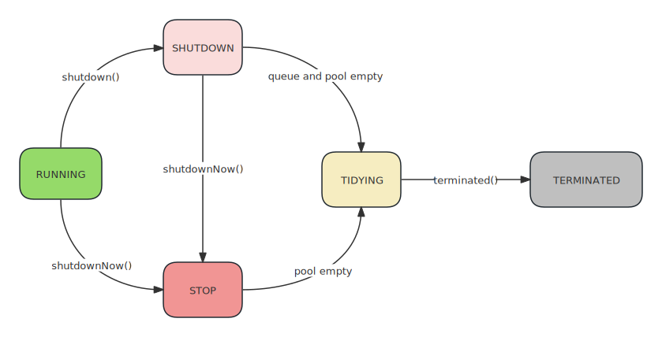

> 线程池是一种用于管理和复用线程的机制。它可以有效地管理多线程任务，提高应用程序的性能和资源利用率，避免频繁地创建和销毁线程。

## ThreadPoolExecutor 简介

Android 提供了一个名为`ThreadPoolExecutor`的类，它是 Java 中`ExecutorService`接口的实现，用于创建线程池。

`ThreadPoolExecutor`允许你创建一个固定大小的线程池，同时还可以配置线程池的核心线程数、最大线程数、线程空闲时间等参数，以适应不同的需求。

##  ThreadPoolExecutor 基本使用

```java
import java.util.concurrent.ExecutorService;
import java.util.concurrent.Executors;

public class MyThreadPool {

    private ExecutorService executor;

    public MyThreadPool() {
        // 创建一个具有固定大小的线程池，这里指定线程池的大小为3
        executor = Executors.newFixedThreadPool(3);
    }

    public void executeTask(Runnable task) {
        // 提交任务给线程池执行
        executor.execute(task);
    }

    public void shutdown() {
        // 关闭线程池
        executor.shutdown();
    }
}
```

使用线程池的好处是，它能够自动管理线程的生命周期，复用线程以减少资源消耗，并且可以避免创建过多的线程导致系统资源不足。

在Android开发中，特别是涉及到多线程的任务，推荐使用线程池来优化性能。

## 配置线程池参数

以下是 `AsyncTask` 类内部用于执行任务的线程池 `THREAD_POOL_EXECUTOR` 的定义: 

```java
private static final int CORE_POOL_SIZE = 1; // 核心线程
private static final int MAXIMUM_POOL_SIZE = 20; // 最大线程
private static final int BACKUP_POOL_SIZE = 5; // 
private static final int KEEP_ALIVE_SECONDS = 3; // 非核心线程最大存活时间

private static final ThreadFactory sThreadFactory = new ThreadFactory() {
    private final AtomicInteger mCount = new AtomicInteger(1);

    // 线程工厂方法
    public Thread newThread(Runnable r) {
        return new Thread(r, "AsyncTask #" + mCount.getAndIncrement());
    }
};

public static final Executor THREAD_POOL_EXECUTOR;

static {
    ThreadPoolExecutor threadPoolExecutor = new ThreadPoolExecutor(
        CORE_POOL_SIZE, MAXIMUM_POOL_SIZE, KEEP_ALIVE_SECONDS, TimeUnit.SECONDS,
        new SynchronousQueue<Runnable>(), sThreadFactory);
    
    // 拒绝策略, 当线程数达到最大线程数, 并且队列已满时, 新添加的任务根据该策略判断怎么处理
    // 默认有四种策略 (CallerRunsPolicy: 直接在调用线程执行 AbortPolicy: 抛出异常 DiscardPolicy: 直接丢弃 DiscardOldestPolicy: 丢弃最早的未被处理的任务
    // 这里使用的是自定义策略, 新开启一个备用的sBackupExecutor线程池执行新任务
    threadPoolExecutor.setRejectedExecutionHandler(sRunOnSerialPolicy);
    THREAD_POOL_EXECUTOR = threadPoolExecutor;
}

// 备用线程池
private static ThreadPoolExecutor sBackupExecutor;

// AsyncTask 中的拒绝策略
private static final RejectedExecutionHandler sRunOnSerialPolicy =
    new RejectedExecutionHandler() {
    public void rejectedExecution(Runnable r, ThreadPoolExecutor e) {
        android.util.Log.w(LOG_TAG, "Exceeded ThreadPoolExecutor pool size");
        // As a last ditch fallback, run it on an executor with an unbounded queue.
        // Create this executor lazily, hopefully almost never.
        synchronized (this) {
            if (sBackupExecutor == null) {
                sBackupExecutorQueue = new LinkedBlockingQueue<Runnable>();
                sBackupExecutor = new ThreadPoolExecutor(
                    BACKUP_POOL_SIZE, BACKUP_POOL_SIZE, KEEP_ALIVE_SECONDS,
                    TimeUnit.SECONDS, sBackupExecutorQueue, sThreadFactory);
                sBackupExecutor.allowCoreThreadTimeOut(true);
            }
        }
        sBackupExecutor.execute(r);
    }
};
```

下面是一些关键的参数和其含义：

1. **`corePoolSize`**: 核心线程数。核心线程数表示在没有任务时，线程池将保持的线程数量。这些线程会一直存在，除非设置了`allowCoreThreadTimeOut`属性为`true`，否则即使它们处于空闲状态，也不会被回收。
2. **`maximumPoolSize`**: 最大线程数。当任务队列已满并且当前线程数量未达到最大线程数时，如果继续有新的任务提交，线程池会创建新的线程，直到线程数达到最大线程数。如果超过最大线程数，后续任务会根据配置的拒绝策略进行处理（比如抛出异常或在主线程中执行）。
3. **`keepAliveTime`**: 非核心线程空闲后的存活时间。当线程池中的线程数量超过核心线程数时，多余的线程在空闲时间超过`keepAliveTime`后会被销毁，直到线程数恢复到核心线程数。
4. **`TimeUnit`**: 时间单位
5. **`workQueue`**: 阻塞队列。当线程池中的线程数达到核心线程数后，后续的任务会被放入该队列中等待执行。常用的阻塞队列有`LinkedBlockingQueue`和`ArrayBlockingQueue`等。
6. **`ThreadFactory`**: 线程工厂。用于创建新的线程。通过自定义`ThreadFactory`，可以给线程指定特定的名称、优先级等属性。
7. **`RejectedExecutionHandler`**: 当线程池无法接受新任务时（通常是由于达到了最大线程数并且队列已满），该处理器定义了如何处理被拒绝的任务。常见的处理策略有丢弃任务、丢弃最旧的任务、抛出异常等。

需要注意的是，虽然`ThreadPoolExecutor`提供了很多配置选项，但在实际使用中，我们应该根据具体的业务需求和系统资源情况来合理配置线程池，避免线程池过大或过小导致性能问题。

## ThreadPoolExecutor 源码分析

### 1. 类定义

```java
public class ThreadPoolExecutor extends AbstractExecutorService {}
public abstract class AbstractExecutorService implements ExecutorService {}
public interface ExecutorService extends Executor {}
public interface Executor {}
```

### 2. 构造函数

```java
public ThreadPoolExecutor(int corePoolSize,
                          int maximumPoolSize,
                          long keepAliveTime,
                          TimeUnit unit,
                          BlockingQueue<Runnable> workQueue,
                          ThreadFactory threadFactory,
                          RejectedExecutionHandler handler) {
    if (corePoolSize < 0 ||
        maximumPoolSize <= 0 ||
        maximumPoolSize < corePoolSize ||
        keepAliveTime < 0)
        throw new IllegalArgumentException();
    
    if (workQueue == null || threadFactory == null || handler == null)
        throw new NullPointerException();
    
    this.corePoolSize = corePoolSize;
    this.maximumPoolSize = maximumPoolSize;
    this.workQueue = workQueue;
    this.keepAliveTime = unit.toNanos(keepAliveTime);
    this.threadFactory = threadFactory;
    this.handler = handler;
}
```

构造函数很简单, 检查参数是否合法, 然后赋值; 

关于参数的说明在[配置线程池参数](#配置线程池参数)解释过了, 这里不再赘述

接下来应该是从`ThreadPoolExecutor`的`execute`方法来追踪代码, 不过在查看`execute`方法之前, 我们先看一下有关线程池状态和数量表示的位运算, 这能帮我们更好的理解后续的内容

### 3. 线程池状态管理和线程数量解析

```java
// ctl 是一个 AtomicInteger 类型的对象，记录了"线程池中任务数量"和"线程池状态"两个信息。
// 它通过使用位操作来合并线程池的状态和线程数量在一个整数中，从而更有效地管理。
// ctl共包括32位。其中，高3位表示"线程池状态"，低29位表示"线程池中的任务数量"。
private final AtomicInteger ctl = new AtomicInteger(ctlOf(RUNNING, 0));

// 表示一个 int 类型的值中用于表示线程数量的位数, 实际的线程数量为2^29个。
// 在这里，它被初始化为 Integer.SIZE - 3，通常是 29，因为 int 类型通常是 32 位(Integer.SIZE = 32)，而高 3 位用于表示线程的状态。
private static final int COUNT_BITS = Integer.SIZE - 3; // 29

// COUNT_MASK 是一个常量，是用于从 ctl 中提取线程数量部分的掩码。它被初始化为 (1 << COUNT_BITS) - 1，即二进制表示下低 29 位都是1，用于屏蔽高位状态位，保留低位线程数量。
private static final int COUNT_MASK = (1 << COUNT_BITS) - 1; // 有符号左移29位, 减一: 低29位全部置1.    0001_1111_1111_1111_1111_1111_1111_1111

// runState 运行状态存储在高位
private static final int RUNNING    = -1 << COUNT_BITS; // 111 运行状态 1110_0000_0000_0000_0000_0000_0000_0000     1001 -> 1110 -> 1111  原码 -> 反码 -> 补码 
private static final int SHUTDOWN   =  0 << COUNT_BITS; // 000 关闭状态 0000_0000_0000_0000_0000_0000_0000_0000
private static final int STOP       =  1 << COUNT_BITS; // 001 停止状态 0010_0000_0000_0000_0000_0000_0000_0000
private static final int TIDYING    =  2 << COUNT_BITS; // 010 有序状态 0100_0000_0000_0000_0000_0000_0000_0000
private static final int TERMINATED =  3 << COUNT_BITS; // 011 终止状态 0110_0000_0000_0000_0000_0000_0000_0000

// Packing and unpacking ctl
// 用于从 ctl 中提取线程池的状态部分。它通过位与操作 (c & ~COUNT_MASK) 来屏蔽低位线程数量，提取高位状态位。
private static int runStateOf(int c)     { return c & ~COUNT_MASK; }

// 用于从 ctl 中提取线程数量部分。它通过位与操作 (c & COUNT_MASK) 来屏蔽高位状态位，提取低位线程数量。
private static int workerCountOf(int c)  { return c & COUNT_MASK; }

// 用于将线程池的状态和线程数量合并为一个整数。它通过位或操作 (rs | wc) 将状态位和线程数量合并在一起，得到最终的 ctl 值。
private static int ctlOf(int rs, int wc) { return rs | wc; }
```

通过上述方式，`ThreadPoolExecutor` 类能够更高效地管理线程池的状态和线程数量，使得状态和数量可以合并在一个整数中，并通过位操作来进行解析。这有助于提高线程池的性能和效率。

#### 线程池状态图:



1. **RUNNING**

   1. 状态说明: 线程池处在RUNNING状态时，能够接收新任务，以及对已添加的任务进行处理。

   2. 状态切换: 线程池的初始化状态是RUNNING。换句话说，线程池被一旦被创建，就处于RUNNING状态

      道理很简单，在 ctl 的初始化代码中(如下)，就将它初始化为RUNNING状态，并且"任务数量"初始化为0

      ```java
      private final AtomicInteger ctl = new AtomicInteger(ctlOf(RUNNING, 0));
      ```

      

2. **SHUTDOWN**

   1. 状态说明: 线程池处在SHUTDOWN状态时，不接收新任务，但能处理已添加的任务。
   2. 状态切换: 调用线程池的 `shutdown()` 接口时，线程池由 RUNNING -> SHUTDOWN。

3. **STOP**

   1. 状态说明: 线程池处在STOP状态时，不接收新任务，不处理已添加的任务，并且会中断正在处理的任务。
   2. 状态切换: 调用线程池的 `shutdownNow()` 接口时，线程池由 (RUNNING or SHUTDOWN )  ->  STOP。

4. **TIDYING**

   1. 状态说明:
      + 当所有的任务已终止，ctl记录的"任务数量"为0，线程池会变为 TIDYING 状态。
      + 当线程池变为 TIDYING 状态时，会执行钩子函数 `terminated()`。terminated()在 ThreadPoolExecutor 类中是空的，若用户想在线程池变为 TIDYING 时，进行相应的处理；可以通过重载terminated()函数来实现。
   2. 状态切换: 
      + 当线程池在 SHUTDOWN 状态下，阻塞队列为空并且线程池中执行的任务也为空时，就会由 SHUTDOWN -> TIDYING。
      + 当线程池在 STOP 状态下，线程池中执行的任务为空时，就会由 STOP -> TIDYING。

5. **TERMINATED**

   1. 状态说明: 线程池彻底终止，就变成TERMINATED状态。
   2. 状态切换: 线程池处在TIDYING状态时，执行完`terminated()`之后，就会由 TIDYING -> TERMINATED。

### 4. execute 执行流程

```java
public void execute(Runnable command) {
    if (command == null)
        throw new NullPointerException();
    
    // 1. 如果工作的线程数少于 corePoolSize, 直接开启一个新线程
    int c = ctl.get();
    if (workerCountOf(c) < corePoolSize) {
        if (addWorker(command, true))
            return;
        c = ctl.get();
    }
    
    // 2. 线程数量 >= 核心线程数, 则将新的任务插入到队列中
    // 当插入队列成功, 我们需要二次检查我们是否应该添加一个线程(因为现有线程自上次检查以来死亡)或者线程池在进入此方法后关闭了
    // 因此我们在必要的情况下需要重新检查状态, 线程池Stop状态下需要回滚排队, 或者如果没有线程的情景下重新启动一个新线程
    if (isRunning(c) && workQueue.offer(command)) {
        int recheck = ctl.get();
        if (! isRunning(recheck) && remove(command))
            reject(command);
        else if (workerCountOf(recheck) == 0)
            addWorker(null, false);
    }
    
    // 3. 当队列已满，开启非核心线程执行任务， 如果 addWorker 返回 false， 则说明当前线程池是 shutdown 状态 
    // 或者 已经饱和(达到最大线程数， 并且队列已满)， 需要执行拒绝策略
    else if (!addWorker(command, false))
        reject(command);
}

// 1. 此方法是向线程池添加工作线程的私有方法
private boolean addWorker(Runnable firstTask, boolean core) {
    retry:
    for (int c = ctl.get();;) {
        // 2. 条件一: 如果线程池已经关闭 
        //    条件二: 线程池停止 或 firstTask != null 或 任务队列为空（没有等待执行的任务）
        // 条件一 和 条件二 都为真, 则返回false, 添加失败, 不再添加新的工作线程。
        if (runStateAtLeast(c, SHUTDOWN)
            && (runStateAtLeast(c, STOP)
                || firstTask != null
                || workQueue.isEmpty()))
            return false;

        for (;;) {
            if (workerCountOf(c)
                >= ((core ? corePoolSize : maximumPoolSize) & COUNT_MASK))
                return false;
            
            // 尝试增加工作线程的计数, 如果成功, 则跳转 retry
            if (compareAndIncrementWorkerCount(c))
                break retry;
            
            // 如果失败, 重新获取当前线程池的状态
            c = ctl.get();  // Re-read ctl
            if (runStateAtLeast(c, SHUTDOWN))
                continue retry;
            // else CAS failed due to workerCount change; retry inner loop
        }
    }

    boolean workerStarted = false;
    boolean workerAdded = false;
    Worker w = null;
    try {
        w = new Worker(firstTask);
        final Thread t = w.thread;
        if (t != null) {
            final ReentrantLock mainLock = this.mainLock;
            mainLock.lock();
            try {
                // 获取锁之后, 重新检测一次线程池状态, 因为有可能在获取到锁之前, 线程池失败 或者 关闭了
                int c = ctl.get();

                // 如果线程池正在运行, 或者线程池运行状态小于STOP(即线程池未被终止), 且 firstTask 为 null (表示没有任务需要执行)
                if (isRunning(c) ||
                    (runStateLessThan(c, STOP) && firstTask == null)) {
                    if (t.getState() != Thread.State.NEW)
                        throw new IllegalThreadStateException();
                    
                    // 添加到集合中, 表示成功添加了一个工作线程
                    workers.add(w);
                    workerAdded = true;
                    int s = workers.size();
                    if (s > largestPoolSize)
                        largestPoolSize = s; // 更新
                }
            } finally {
                mainLock.unlock();
            }
            
            // 添加成功
            if (workerAdded) {
                t.start(); // 线程启动运行
                workerStarted = true;
            }
        }
    } finally {
        // 添加失败
        if (! workerStarted)
            addWorkerFailed(w);
    }
    return workerStarted;
}

```

`execute` 函数主要有三个逻辑:

1. 如果工作的线程数少于 `corePoolSize`, 直接开启一个新线程
2. 线程数量 >= 核心线程数，则将新的任务插入到队列中
3. 当队列已满，开启非核心线程执行任务。如果 `addWorker` 返回 false， 则说明当前线程池是 shutdown 状态 或者 已经饱和(达到最大线程数，并且队列已满)，需要执行拒绝策略

`addWorker` 函数也主要做了三件事:

1. 检测线程池状态
2. 开启线程并执行任务
3. 线程添加失败后，执行拒绝策略

至此，整个线程池的执行流程都已完毕。

